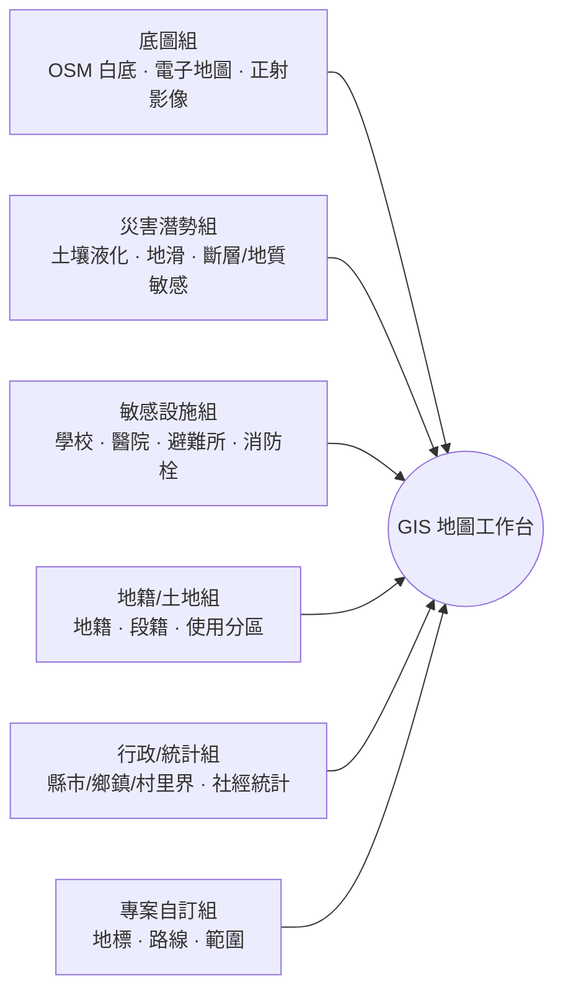
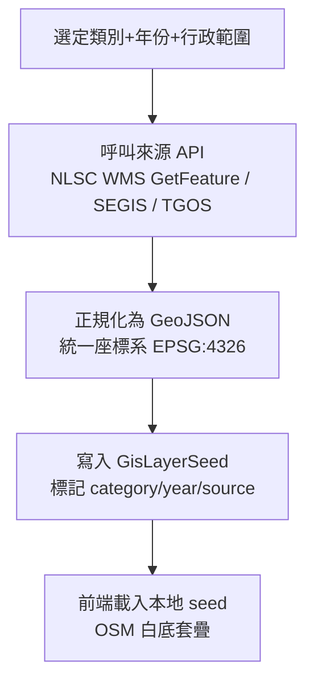
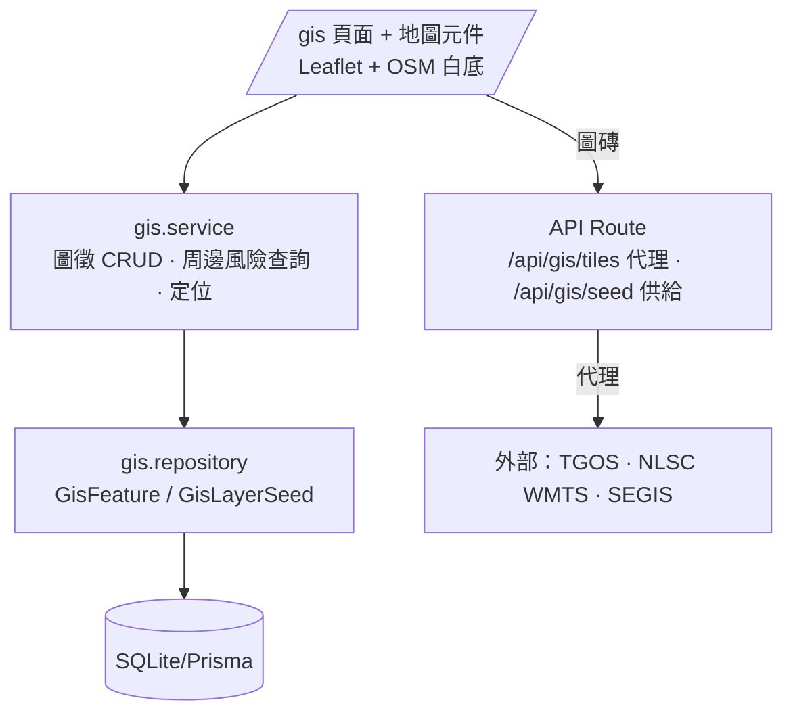

# GIS 地圖（Geographic Information）功能規劃

> PMIS-12 GIS 地圖模組 — 設計提案（規劃書）
> 版本 v0.1｜對應 PMIS 智慧監造管理系統
> 階段：功能概念規劃（尚未實作程式）
> 觀點：以**現場工程師／監造人員**日常需求出發

---

## 0. 模組編號調整

導入本模組時同步調整功能編號，避免與既有模組衝突：

| 原編號 | 名稱 | 新編號 |
| --- | --- | --- |
| — | **GIS 地圖（新增）** | **PMIS-12** |
| PMIS-12 | 資料庫 | **PMIS-13** |
| PMIS-13 | 人員管理 | **PMIS-14** |

系統模組總數由 13 增為 14。已同步更新 `sidebar` 導航、`feature-guide` 功能說明與 `documents` 頁標題。

---

## 1. 目標與問題定義

現場工程師到一個新工地，最先要問的往往不是「圖畫得對不對」，而是**「這塊地周邊有什麼會影響我施工的東西？」**——會不會踩到土壤液化區、旁邊是不是學校（噪音／施工時間受限）、有沒有活動斷層或地滑潛勢、最近的避難所與消防栓在哪、便道要怎麼走、圍籬圈到哪裡。這些資訊目前分散在各政府網站，查詢費時且無法與專案綁定。

本模組的目標：在 PMIS 內提供一個**以工地為中心的空間資訊工作台**，把臺灣政府開放圖資套疊到一張乾淨的 OpenStreetMap 白底底圖上，讓使用者：

1. **快速判讀工地周邊風險與限制**（災害潛勢、鄰近敏感設施、地籍與土地使用分區）。
2. **自由開關各主題圖層**，只看當下關心的資訊，避免地圖雜亂。
3. **以專案為單位管理空間資訊**，切換專案即聚焦其工區，並可疊加該專案自訂的地標、路線與範圍。

> 定位：本模組是**判讀與規劃輔助工具**，非法定測量或核發依據。圖資僅供參考，正式界址與潛勢認定仍以主管機關公告資料為準（介面需標註此聲明）。

---

## 2. 現場工程師使用情境（Scenario-Driven）

設計以下列真實情境反推功能，確保「好用」而非「功能堆疊」：

| # | 情境 | 需要的圖層／功能 |
| --- | --- | --- |
| S1 | **開工前場勘**：新標案進場，快速盤點工地周邊風險 | 土壤液化潛勢、地質敏感區（山崩地滑）、活動斷層、正射影像 → 一鍵「周邊風險摘要」 |
| S2 | **施工限制確認**：工地緊鄰學校，需管制噪音與施工時段 | 各級學校範圍圖 + 距離量測；周邊敏感點清單 |
| S3 | **交通維持計畫**：規劃工程車輛動線與便道 | 道路路網 + 自訂路線（線圖徵）+ 圈定施工區 |
| S4 | **緊急應變準備**：安衛需掌握最近避難所與消防栓 | 避難收容所、消防栓、醫院 POI + 路徑距離 |
| S5 | **用地與界址初判**：確認施工範圍是否越界或涉公有地 | 地籍圖／段籍圖、公有土地地籍、非都市土地使用分區 |
| S6 | **交底與巡查**：把巡查發現、危險點、機具定位標在圖上分享 | 自訂地標（可帶照片／連結缺失）、圖徵匯出 |
| S7 | **社會經濟評估**：說明工程對周邊里別人口的影響 | 內政部統計地圖（村里人口／社經統計） |

---

## 3. 資料來源與圖層目錄

三個政府 API 各有分工，整合後形成本模組的圖層目錄。以下 WMTS 圖層代碼取自**國土測繪圖資服務雲 WMTS GetCapabilities（實際查證）**，可直接作為 seed 依據。

### 3.1 臺灣政府 TGOS MAP API

內政部 TGOS（地理資訊圖資雲服務平台）主要提供：

- **地址定位 / 門牌坐標查詢（Geocoding）**：把專案的工地地址（PMIS-03 `Project.location`）轉為經緯度，作為地圖定位中心。
- **通用電子地圖圖磚服務**：可作為底圖或行政界參考。
- 用途：**專案工地定位**、地址正規化。需申請 API Key。

### 3.2 國土測繪圖資服務雲 API（NLSC）— 主力圖層來源

提供 WMTS／WMS 圖磚服務與坐標轉換、地籍查詢 API。與監造最相關的圖層：

| 類別 | 圖層（Title） | WMTS Identifier | 現場用途 |
| --- | --- | --- | --- |
| 底圖 | 臺灣通用電子地圖（無文字） | `EMAPX99` | 疊在 OSM 上的乾淨參考底圖 |
| 底圖 | 正射影像（通用） | `PHOTO2` | 對照現地實況（衛星影像） |
| 底圖 | 正射影像（混合） | `PHOTO_MIX` | 影像＋註記 |
| **災害潛勢** | 土壤液化潛勢_初級 | `SoilLiquefaction` | **工地是否位於液化潛勢區** |
| **災害潛勢** | 地質敏感區（山崩與地滑） | `GeoSensitive2` | 邊坡／地滑風險 |
| **災害潛勢** | 地質敏感區 | `GeoSensitive` | 含活動斷層等地質敏感類別 |
| 敏感設施 | 各級學校範圍圖 | `SCHOOL` | **是否鄰近學校**（噪音／時段管制） |
| 應變 | 避難收容所 | `SHELTERS` | 緊急應變據點 |
| 應變 | 消防栓 | `fireplug` | 消防水源位置 |
| 交通 | 道路路網 | `ROAD` | 動線／便道規劃 |
| 地籍 | 地段外圍圖（段籍圖） | `LANDSECT` | 段界參考 |
| 地籍 | 公有土地地籍圖 | `LAND_OPENDATA` | 是否涉公有地 |
| 土地使用 | 非都市土地使用分區圖 | `nURBAN1` | 使用分區限制 |
| 土地使用 | 非都市土地使用地類別圖 | `nURBAN2` | 使用地類別 |
| 土地使用 | 國土利用現況調查成果圖 | `LUIMAP` | 現況地類 |
| 行政界 | 縣市界／鄉鎮區界／村里界 | `CITY`／`TOWN`／`Village` | 行政範圍套疊 |
| 地形 | 1/5000 基本地形圖、等高線 | `B5000` 等 | 地形判讀 |

> 註：**活動斷層**的權威來源為經濟部中央地質調查所（CGS）之地質敏感區（活動斷層）。NLSC 之 `GeoSensitive` 已涵蓋地質敏感區類別；若需更精細的活動斷層線，第二階段可另接 CGS 圖資服務。

### 3.3 內政部統計地圖 API（SEGIS 社會經濟資料服務平台）

提供**村里／統計區為單位的社會經濟統計**（人口數、年齡結構、家戶等）與對應統計區界。

- 用途：S7 社會經濟影響評估、周邊里別人口概況。以主題式統計面量（choropleth）呈現。

### 3.4 圖層分組（介面呈現用）



---

## 4. Data Seed 策略（依年份、類別下載離線快取）

政府服務偶有不穩或流量限制，且部分圖資（如潛勢、統計）**更新週期以年為單位**。因此採「**同步下載為 seed 檔、系統讀本地快取**」策略，而非每次即時打外部 API。

### 4.1 設計原則

1. **來源分層**：即時服務（TGOS 定位、NLSC WMTS 圖磚）走 proxy 代理；低頻更新的向量／統計資料（潛勢範圍、統計區、學校點位）下載為 seed。
2. **以「類別 × 年份」為版本單位**：每份 seed 標記 `category`、`year`、`source`、`srs`（座標系，預設 EPSG:4326／3857），可多版本並存、可切換與追溯（呼應碳盤查係數版本設計精神）。
3. **格式**：向量資料存 **GeoJSON**（前端直接吃）；圖磚類記錄 WMTS 樣板 URL 與圖層代碼即可，不落地圖磚。
4. **範圍裁切**：seed 下載時可依專案所在縣市／鄉鎮裁切，縮小檔案。

### 4.2 Seed 下載流程



### 4.3 目錄與腳本建議

- seed 資料放 `prisma/seeds/gis/{category}/{year}.geojson`。
- 下載腳本 `scripts/gis-fetch.ts`（Node，離線批次執行），輸出 GeoJSON 並登錄 `GisLayerSeed`。
- WMTS 圖磚代理走 API route（見 §7），避免前端直連與 CORS 問題。

---

## 5. 介面設計（OSM 白底工作台）

### 5.1 版面

```
┌───────────────────────────────────────────────────────────────┐
│ 頁首：GIS 地圖 (PMIS-12)     [專案切換 ▼]   [搜尋地址/座標 🔍]   │
├──────────────┬────────────────────────────────────────────────┤
│ 圖層面板      │                                                │
│ ▸ 底圖        │                                                │
│   ○ OSM 白底  │              OpenStreetMap 白底底圖              │
│   ○ 正射影像  │              （工地為中心，套疊圖層）            │
│ ▸ 災害潛勢    │                                                │
│   ☑ 土壤液化   │                 📍 工地中心點                    │
│   ☑ 地滑/斷層 │                 ▭ 施工範圍（自訂面）             │
│   [透明度──]  │                 ── 便道路線（自訂線）            │
│ ▸ 敏感設施    │                                                │
│   ☑ 學校      │                                                │
│   ☐ 避難所    │                                                │
│ ▸ 地籍/土地   │                                                │
│ ▸ 行政/統計   │                                                │
│ ▸ 專案自訂 ✎  │                                                │
├──────────────┴────────────────────────────────────────────────┤
│ 底部：周邊風險摘要條  ⚠ 位於液化中潛勢 · 距最近學校 180m · …    │
└───────────────────────────────────────────────────────────────┘
```

### 5.2 底圖為何「白底」

採 OpenStreetMap 的淺色／無彩底圖樣式（如 CartoDB Positron 風格，或 NLSC `EMAPX99` 無文字版），讓套疊的**潛勢面量、地籍線、自訂圖徵**在視覺上跳出來、不被彩色底圖干擾。底圖本身可再切換為正射影像對照現地。

### 5.3 圖層面板互動

- 每層：**顯示開關**、**透明度滑桿**、**堆疊順序**（拖曳）、圖例（legend）。
- 分組可折疊；記住使用者上次的開關狀態（`localStorage` 或使用者偏好）。
- 面量圖層（潛勢、統計）附色階圖例；點圖層（學校、消防栓）附圖示。

### 5.4 周邊風險摘要（本模組亮點）

以工地中心點做空間查詢，自動產生一句話摘要與清單：

> ⚠ 工地位於**土壤液化中潛勢區**；300 m 內有**○○國小**（噪音管制）；未落於地質敏感區；最近避難所 ○○活動中心（450 m）、最近消防栓 60 m。

此摘要可回饋到 **PMIS-01 行事曆預警**（開工前風險提醒）與 **PMIS-05 環安衛**（應變據點），並可由**費思 AI** 以自然語言解讀圖層結果。

---

## 6. 專案切換與自訂圖徵

### 6.1 專案切換

沿用系統既有的專案下拉切換（如 PMIS-04/05）。切換後：

- 地圖飛至該專案工地座標（由 `Project.location` 經 TGOS geocoding 或已存座標定位）。
- 僅載入該專案的自訂圖徵。
- 「全部專案」模式：以群集標記（cluster）顯示所有工地分佈。

### 6.2 自訂圖徵（點／線／面）

現場工程師可針對專案繪製並儲存：

| 類型 | 幾何 | 現場用途範例 |
| --- | --- | --- |
| **地標** | Point | 大門、機具停放、危險點、拍照點、監測井 |
| **路線圖** | LineString | 工程車動線、便道、臨時管線、疏散路線 |
| **圈定範圍** | Polygon | 施工圍籬、警戒區、分區、用地界 |

每個圖徵可設定：名稱、顏色、備註、可見性，並**可連結到其他模組資料**（如某地標連到 PMIS-07 的一筆缺失、或 PMIS-05 的一次稽核），達成「圖上點一下就看到現場紀錄」。圖徵可匯出 GeoJSON／KML 供外部使用。

---

## 7. 技術架構（對齊專案分層）

遵守專案單向分層（頁面 → service → repository → DB），外部圖資存取集中在後端代理與 seed 載入。



- **地圖函式庫**：建議 **Leaflet**（輕量、WMTS/GeoJSON 支援好、白底樣式容易）。底圖用 OSM／Positron 圖磚，NLSC 圖層以 `L.tileLayer`（WMTS）套疊。
- **WMTS 代理**：`/api/gis/tiles/[layer]/...` 代理 NLSC，統一注入參數並處理快取，避免前端直連。
- **座標系**：對外顯示 EPSG:3857（web mercator），資料儲存 EPSG:4326；TWD97／經緯度轉換可用 NLSC 坐標轉換 API 或前端 proj4。
- **RWD**：手機版圖層面板改為底部抽屜，支援現場平板／手機查詢（呼應系統既有 RWD 原則）。

> 相依套件：本模組需新增 `leaflet`（與型別）。屬第二階段實作項目，本規劃階段未安裝。

---

## 8. 資料模型（規劃）

新增兩個模型，均以 `Project` 為核心關聯（延續系統設計）。以下為**規劃草案**，實作時併入 `prisma/schema.prisma`。

```prisma
// PMIS-12 GIS 地圖

/// 專案自訂圖徵（點/線/面）。
model GisFeature {
  id         String         @id @default(cuid())
  projectId  String
  name       String
  type       GisFeatureType // MARKER / ROUTE / AREA
  geojson    String         // GeoJSON geometry (WGS84)
  color      String?
  note       String?
  linkModule String?        // 關聯模組，如 DEFECT / EHS / INSPECTION
  linkId     String?        // 關聯資料 id
  visible    Boolean        @default(true)
  createdBy  String?
  createdAt  DateTime       @default(now())
  updatedAt  DateTime       @updatedAt
  deletedAt  DateTime?

  project Project @relation(fields: [projectId], references: [id], onDelete: Cascade)

  @@index([projectId])
  @@index([type])
}

/// 政府圖資 seed（依類別×年份版本化）。
model GisLayerSeed {
  id        String   @id @default(cuid())
  category  String   // SOIL_LIQUEFACTION / GEO_SENSITIVE / SCHOOL / SHELTER ...
  title     String
  source    String   // NLSC / TGOS / SEGIS
  wmtsCode  String?  // 圖磚圖層代碼，如 SoilLiquefaction
  year      Int
  srs       String   @default("EPSG:4326")
  filePath  String?  // GeoJSON seed 路徑（向量類）
  isDefault Boolean  @default(false)
  active    Boolean  @default(true)
  createdAt DateTime @default(now())

  @@unique([category, year])
  @@index([category])
}

enum GisFeatureType {
  MARKER
  ROUTE
  AREA
}
```

`Project` 另建議補欄位（可選）：`lat Decimal?`、`lng Decimal?` 快取工地座標，避免每次重新 geocoding。

---

## 9. 與其他模組的整合

| 模組 | 整合點 |
| --- | --- |
| PMIS-03 工程專案 | 工地座標來源；專案總覽可嵌入小地圖 |
| PMIS-01 行事曆預警 | 開工前「周邊風險摘要」轉為預警事項 |
| PMIS-05 環安衛 | 避難所／消防栓應變資訊；稽核點位標於圖上 |
| PMIS-07 品質稽核 | 缺失／查驗點位可連結地圖圖徵，圖上定位 |
| PMIS-10 智能監測 | 攝影機／感測器位置標於圖上 |
| 費思 AI | 以自然語言解讀圖層與風險摘要、回答「工地周邊有什麼」 |

---

## 10. 分階段導入藍圖

| 階段 | 範圍 | 狀態 |
| --- | --- | --- |
| **階段一** | 概念規劃、模組編號調整、in-app 概念頁 `/gis`、功能說明更新 | ✅ 已完成 |
| **階段二** | 資料層：`GisFeature`／`GisLayerSeed` schema、圖層目錄 seed、OSM 白底 + NLSC WMTS 代理（`/api/gis/tiles`）、圖層開關與透明度 | ✅ 已完成 |
| **階段三** | 專案切換、工地座標定位、自訂圖徵（地標／路線／範圍）繪製與儲存、刪除 | ✅ 已完成 |
| **階段四** | 周邊風險摘要（向量 seed 本地空間查詢）、PMIS-01/05/07 現場狀態整合、費思 AI 工地簡報、圖徵匯出（GeoJSON/KML）、工地定位（地圖點選／TGOS 選配） | ✅ 已完成（示範向量資料） |
| **階段五** | 圖徵↔缺失/環安衛雙向連結、SEGIS 統計面量（choropleth）、離線圖磚磁碟快取、向量圖資匯入框架（`scripts/gis-fetch.ts`） | ✅ 已完成（框架＋示範資料；全國圖資屬資料維運） |

> 階段五補充：
> - **圖徵連結**：新增圖徵時可連結專案的缺失（PMIS-07）或環安衛稽核（PMIS-05），地圖 popup 直接深連結至該模組頁。
> - **SEGIS 統計面量**：新增 `STATS` 圖層類別，前端經 `/api/gis/vector/{id}` 取向量並以 `value` 屬性分級著色（choropleth），附示範村里人口資料。
> - **離線圖磚快取**：`/api/gis/tiles` 代理加入磁碟快取（`os.tmpdir()/pmis-gis-tiles`），重複瀏覽以 `X-Tile-Cache: HIT` 命中，降低對 NLSC 的重複請求。
> - **匯入框架**：`npm run gis:fetch` 下載政府 GeoJSON/WFS、寫入 seed 並輸出登錄 SQL；正式全國圖資（潛勢、敏感區、設施、統計）依此流程覆蓋示範資料即可，程式無需改動。

> **重要技術發現**：NLSC WMS 之圖層均為 `queryable="0"`，**不支援 GetFeatureInfo 點位查詢**，故「是否位於潛勢區」無法即時向 NLSC 查詢。本模組改採規劃書原訂之**本地向量 seed 空間查詢**（point-in-polygon／最近距離，見 `src/lib/geo.ts`）：將圖資下載為 GeoJSON 放於 `prisma/seeds/gis/`，由 `GisLayerSeed.filePath` 掛載。目前提供**捷運藍線工地周邊的示範向量資料**驗證功能；正式導入時以實際全國圖資覆蓋即可，程式無需改動。
>
> 周邊風險摘要同時彙整該專案的未結案缺失（PMIS-07）、環安衛待改善（PMIS-05）與近 30 日到期提醒（PMIS-01），並可由費思 AI 產生開工前注意事項簡報（未設定 `AI_KEY` 時回退為規則式摘要）。圖徵可經 `/api/gis/export/{projectId}?format=geojson|kml` 匯出。

> 實作備註：本機執行 `npm run db:reset`（或 `prisma db push` + `npm run db:seed`）即可套用 `Project.lat/lng`、`GisFeature`、`GisLayerSeed` 資料表與範例資料。圖磚經 `/api/gis/tiles/{layer}/{z}/{x}/{y}` 代理至 NLSC WMTS（`GoogleMapsCompatible`，z/y/x 順序）。地圖前端採 Leaflet，底圖預設 OSM 白底（CARTO Positron 樣式），可切換 NLSC 電子地圖／正射影像。

---

## 11. 風險與注意事項

1. **圖資授權與標註**：政府開放圖資多為政府資料開放授權條款，使用需標示來源；部分地籍/影像有使用範圍限制，商用前須確認。
2. **API Key 與流量**：TGOS 定位、部分服務需申請金鑰並有流量上限 → 以 seed 快取與後端代理降低即時依賴。
3. **座標系一致性**：務必統一 WGS84 儲存、web mercator 顯示，避免偏移。
4. **免責聲明**：介面須標示「圖資僅供參考，界址與潛勢以主管機關公告為準」。
5. **端點時效**：本規劃所列 WMTS 代碼取自現行 GetCapabilities，實作前建議再次核對官方最新文件（政府服務網址與圖層偶有調整）。

---

> 後續實作可依 §10 階段二起逐步落地；本階段已完成概念規劃與系統整合（導航、功能說明、概念頁）。
