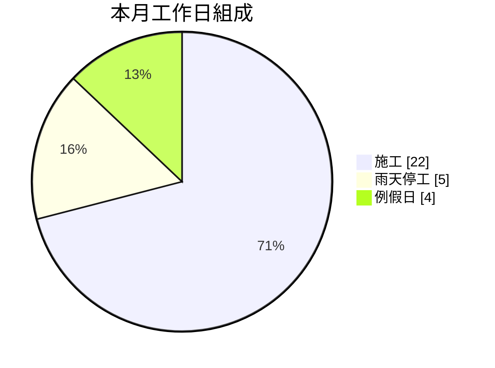

# 監造月報範本

> 用途：確認格式。以下數值皆為示意 mock data，非實際工程資料。
> 設計原則：**法定必填欄位與逐日日誌一律完整保留**；新增的圖表與統計只作為「額外的判讀輔助」，不取代任何原有紀錄。
> 圖表語法採 PMIS 現有渲染管線（`mermaid 與四種 `custom-\* 圍欄），可直接在報告畫面渲染。

---

# XX 公司 5 月份監造月報

> 報告期間 2026-05-01 ~ 2026-05-31｜產生時間 2026-06-01
> **本報告為費思 AI 生成草稿；數字由系統彙整、圖表由既有數據集展開；核定前請人工確認。**

## 一、工程基本資料

> 第 0 層：識別資訊。維持表格，法定欄位不變動、不圖表化。

| 項目     | 內容            | 項目         | 內容                |
| -------- | --------------- | ------------ | ------------------- |
| 主辦單位 | A 單位          | 監造單位     | 甲公司              |
| 承攬廠商 | 乙公司          | 工程名稱     | XX 街區清理工程計劃 |
| 開工日期 | 90 年 1 月 2 日 | 預定完工日期 | 100 年 1 月 2 日    |
| 契約金額 | 300,000,000 元  | 契約工期     | 3,000 工作天        |

**工程概要**

> 每項一句（品項＋數量），逐項條列。整句即為 `ContractScopeItem.title` 的內容，不需拆成數量／單位欄位，故無須新增 schema 欄位；項目數多時仍可逐行掃讀。

- 人孔 20 座
- 陰井 10 座
- 排水口 300 處
- 用戶接管 100 戶
- 化冀池打除 100 處
- 幹管埋設 2,400 m
- 抽水站 2 站
- 路面回復 4,200 m²
- 側溝 1,850 m
- 標誌標線 320 式
- 臨時排水 600 m
- 交通維持 1 式

## 二、本月摘要

> 第 1 層：新增。把原本散在各表的數字算出「落差」與「趨勢」，供管理判讀；不含任何新事實，全部由既有數字推導。

| 指標     | 本月  | 累計                      | 落差（完成 − 預定）              |
| -------- | ----- | ------------------------- | -------------------------------- |
| 預定進度 | 3.00% | 40.01%                    | —                                |
| 完成進度 | 4.00% | 50.00%                    | 本月 +1.00 pp／累計 **+9.99 pp** |
| 工期使用 | —     | 1,000 / 3,000 天（33.3%） | 剩餘 2,000 天                    |

**累計進度趨勢**

```custom-scurve
title: 累計進度趨勢
yAxis: 累計進度
unit: %
12月, 25, 28
1月, 28, 33
2月, 31, 38
3月, 34, 42
4月, 37.01, 46
5月, 40.01, 50
```

**本月評述**（AI 敘述層，僅就上表數字說明，不引入新數據）

本月完成 4.00%，高於預定 3.00%，累計進度達 50.00%、領先預定 9.99 個百分點；工期僅使用 33.3%，整體處於超前狀態。雨天停工 5 天未對進度造成延誤。建議持續關注雜項與交通工程之累計完成偏低情形，避免後期集中趕工。

## 三、進度分析

> 第 2 層：圖負責判讀、表負責查核，兩者並存。表格為契約金額之正式紀錄，不得省略。

### 3.1 整體進度

| 項目         | 數值     | 項目         | 數值     |
| ------------ | -------- | ------------ | -------- |
| 累積工期     | 1,000 天 | 剩餘工期     | 2,000 天 |
| 本月預定進度 | 3.00%    | 累計預定進度 | 40.01%   |
| 本月完成進度 | 4.00%    | 累計完成進度 | 50.00%   |

### 3.2 各工程項目完成情形

長條總長為累計完成，末端深色區段為本月增量，可同時判讀「總量」與「本月貢獻」：

```custom-progress
title: 各工程項目完成百分比
unit: %
xScale: 100
管線工程, 70, 2
雜項, 30, 1
交通, 30, 10
```

### 3.3 工程項目估驗明細

> 法定紀錄，欄位與原格式完全一致；「合計」列由系統決定論計算後補齊。

| 項次 | 工程項目 | 單位權重  | 合約金額       | 本月完成百分比 | 累計完成百分比 | 本月完成金額  | 累計完成金額   |
| ---- | -------- | --------- | -------------- | -------------- | -------------- | ------------- | -------------- |
| 1-1  | 管線工程 | 20%       | 40,000,000     | 2%             | 70%            | 2,000,000     | 30,000,000     |
| 1-2  | 雜項     | 0.3%      | 300,000        | 1%             | 30%            | 100,000       | 800,000        |
| 1-3  | 交通     | 10%       | 1,000,000      | 10%            | 30%            | 400,000       | 700,000        |
| —    | **合計** | **30.3%** | **41,300,000** | —              | —              | **2,500,000** | **31,500,000** |

## 四、工作事項

> 第 3 層：先給彙整統計（可判讀），再給逐日明細（可查核）。原始日誌一筆不刪。

### 4.1 本月工作統計

| 項目       | 數量  | 說明                 |
| ---------- | ----- | -------------------- |
| 施工天數   | 22 天 | 實際有施工紀錄之日數 |
| 雨天停工   | 5 天  | 因天候暫停施工之日數 |
| 例假日     | 4 天  | 未排工日數           |
| 化冀池打除 | 38 處 | 本月累計             |
| 用戶接管   | 64 戶 | 本月累計             |



### 4.2 逐日工作事項明細

> 當月 1 日至月底逐日完整列示，作為查核依據。原格式的分隔線改為表格，資訊不減、較易對照。

| 日期 | 星期 | 天氣   | 工作事項                                                                     |
| ---- | ---- | ------ | ---------------------------------------------------------------------------- |
| 5/01 | 五   | ☀️晴   | 1. 化冀池打除：XX 街 1-10 號。<br>2. 用戶接管：XX 街 1-10 號、WW 街 500 號。 |
| 5/02 | 六   | ☀️晴   | 例假日，未施工。                                                             |
| 5/03 | 日   | ☁️多雲 | 例假日，未施工。                                                             |
| 5/04 | 一   | ☁️多雲 | 1. 化冀池打除：WW 街 500 號。<br>2. 用戶接管：XX 街 11-20 號、FF 街 20 號。  |
| 5/05 | 二   | 🌧️雨   | 本日下雨，暫停施工。                                                         |
| …    | …    | …      | （中略，逐日續列）                                                           |
| 5/30 | 六   | ☀️晴   | 1. 化冀池打除：XX 街 1-10 號。<br>2. 用戶接管：XX 街 1-10 號、WW 街 500 號。 |
| 5/31 | 日   | ☀️晴   | 例假日，未施工。                                                             |

## 五、簽章

| 監造單位 | 承攬廠商 | 主辦單位 |
| -------- | -------- | -------- |
| （簽章） | （簽章） | （簽章） |

---

## 附註：與原格式的差異對照

| 項目     | 原格式               | 本範本                                         | 理由                                                       |
| -------- | -------------------- | ---------------------------------------------- | ---------------------------------------------------------- |
| 基本資料 | 表格                 | **不變**                                       | 識別資訊，表格最有效                                       |
| 工程概要 | 單列以「／」串接     | **改為逐項條列**（每項一句：品項＋數量）       | 正式版十餘項以上，串接成長句無法查對；條列可掃讀且不需新增欄位 |
| 本月摘要 | 無                   | **新增**（落差表 + S-Curve + 評述）            | 原格式需讀者自行做減法才知超前或落後                       |
| 進度數字 | 表格                 | 表格**保留** + 摘要層另呈現                    | 法定紀錄不動                                               |
| 工項明細 | 8 欄表格、合計列空白 | 表格**保留**，補齊合計；另加累計進度橫條圖     | 合計可決定論算出，且審核必看；橫條圖可同時看總量與本月增量 |
| 工作事項 | 30 段分隔線文字      | **統計摘要** + 逐日**表格**                    | 原格式無結構；雨天停工天數原本埋在文字中                   |
| 簽章     | 有                   | **不變**                                       | 法定要件                                                   |

## 附註：待確認事項

- **衍生指標用語**：本範本用「落差（pp）」而非「達成率（%）」。若貴單位慣用其他說法，應以慣用語為準，避免審核方認為自創指標。
- **S-Curve 已改用 `custom-scurve`**：原先的 mermaid `xychart-beta` 其 lexer 不支援中文標籤與全形括號（會出現 Lexical error），且無圖例。現改為 PMIS 自有 SVG 元件，支援中文、含圖例與端點數值標註，並可選填第 4 欄「預測累計」。
- **逐日明細呈現**：改為表格是為了可掃讀；若送審格式要求維持分隔線樣式，可只在系統畫面用表格、匯出時轉回分隔線。
- **例假日認定**：本範本將「例假日」與「雨天停工」分開統計，因兩者在工期展延爭議中意義不同；需確認貴單位是否同樣區分。
