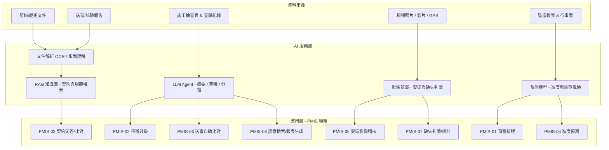

# PMIS AI 流程優化設計

本文件說明如何在既有 PMIS 監造流程上疊加 AI 能力，目標是**把人力從重複性抄錄與比對中釋放出來，並把「事後記錄」升級為「事前預警」**。設計以官方 PMIS 推廣版流程為基礎，對應現行各功能模組逐一提出優化方案。

---

## 零、目前已實作的 AI 能力（費思）

系統已內建「費思」AI 助理，右下角常駐浮動視窗，並在各模組提供下列**已上線**能力：

- **對話問答**：回答預警、缺失、送審、進度等監造相關問題。
- **任意檔案判讀**：可拖曳或上傳 PDF、影像、文件交由費思分析。
- **財務憑證轉會計傳票（PMIS-08）**：上傳發票／收據／請款單，自動擷取日期、收支方向、科目、金額、對象並回填傳票，經人工確認後入帳。
- **工程報告自動生成（PMIS-11）**：依系統紀錄生成日／週／月／季／年報，採含圖表的 Markdown，並由 AI 撰寫摘要與建議。
- **工地影像判讀（PMIS-05）**：上傳工地照片，辨識工安與品質疑慮並提出改善建議。

> 以下第一節起為更完整的 **AI 流程優化規劃藍圖**，部分能力（如 RAG 契約問答、進度預測、送審自動比對）仍屬規劃／示範階段。
>
> **編號對照**：本規劃藍圖第三節沿用**官方 PMIS 推廣版**的 8 大類流程編號（PMIS-01～08），與本系統「系統總覽」分頁之現行 **14 模組**編號並非一一對應。例如藍圖中的「PMIS-08 文件/照片/影片資料庫」對應本系統之 **PMIS-13 資料庫**。閱讀時請以各段落標題文字為準。

---

## 一、設計原則

1. **人在迴路中（Human-in-the-loop）**：AI 只做建議、草稿、排序與偵測；核定、簽章、退件等決策一律保留給監造人員，符合公共工程責任歸屬與數位簽章規範。
2. **可稽核、可回溯**：每一次 AI 產出都保存輸入來源、模型版本與信心分數，並標註「AI 生成」，供查核委員檢視。
3. **不取代既有表單格式**：AI 產出仍匯回工程會標準表單（WORD/PDF/ODT、CMIS 格式），不破壞既有送審與歸檔規範。
4. **漸進導入**：先做低風險、高頻次的輔助（提醒、摘要、OCR），再進到預測與影像判讀。

---

## 二、整體架構

三層架構：**資料層**（既有 PMIS 表單、文件與影像）→ **AI 服務層**（OCR、RAG、影像、預測、LLM）→ **應用層**（回饋到各模組介面）。AI 服務層以獨立微服務部署，透過 API 與現行系統整合，降低對核心業務邏輯的侵入。

---

## 三、各模組 AI 優化方案

### PMIS-01 行事曆提醒及預警
- **痛點**：期限眾多（履約、送審、查核、改善），靠人工盯行事曆易漏，且所有提醒權重相同。
- **AI 方案**：**逾期風險評分**。以歷史資料學習各類事件的實際延遲機率，對即將到期事項做風險排序，把「最可能出事」的項目推到儀表板最前；並自動生成當日待辦摘要與建議處理順序。
- **技術**：時間序列/梯度提升預測 + LLM 摘要。
- **產出**：風險分級提醒清單、每日 AI 摘要。

### PMIS-02 待辦事項追蹤
- **痛點**：跨單位待辦分散、改善辦理情形需人工彙整與催辦。
- **AI 方案**：LLM 自動把缺失/退件/待簽核事項**歸戶到責任單位**、生成催辦訊息草稿；逾期自動升級（承辦 → 主管），並偵測「同一部位反覆缺失」的異常樣態。
- **技術**：LLM 分類與生成 + 規則引擎。
- **產出**：自動分派、催辦草稿、重複缺失警示。

### PMIS-03 契約履約管理
- **痛點**：契約條款、變更、罰則與付款節點分散於文件，查找費時，變更後易與履約期限脫鉤。
- **AI 方案**：**契約 RAG 問答**——以自然語言查詢「第 3 次變更後的完工日？」「逾期罰則如何計算？」並附條款出處；契約變更時自動比對受影響的里程碑/付款節點並提示更新。
- **技術**：文件 OCR + 向量檢索 + LLM（附引用來源，避免幻覺）。
- **產出**：條款問答、變更影響清單、付款節點提醒。

### PMIS-04 時程進度管理
- **痛點**：落後往往在事後才發現。
- **AI 方案**：以預定/實際進度、天氣、缺失數、送審延遲等特徵**預測完工日與落後機率**，並模擬變更/展延對關鍵路徑的影響；行動裝置推播落後預警。
- **技術**：迴歸/序列預測 + 關鍵路徑分析。
- **產出**：完工日預測區間、落後熱點、情境模擬。

### PMIS-05 環安衛管理
- **痛點**：現場安衛巡檢仰賴人眼，難全面且難量化。
- **AI 方案**：**現場照片/影片影像辨識**，自動偵測未戴安全帽/背心、防墜與臨邊防護缺失、動火與高風險作業等，產生違規標註與初步缺失單草稿；結合 GPS 座標定位缺失位置。
- **技術**：物件偵測（YOLO 類）/視覺語言模型 + 地理標註。
- **產出**：安衛違規偵測、缺失單草稿、熱區地圖。
- **注意**：影像判讀僅供輔助示警，最終認定由監造工程師負責。

### PMIS-06 送審文件材料管理
- **痛點**：送審資料（型錄、試驗報告）需人工核對是否符合規範，退件原因重複發生。
- **AI 方案**：**OCR + 規範自動比對**——擷取試驗報告數值，比對抽驗管理標準（強度、規格等）並標示不符項目；預測退件風險並提示常見退件原因，減少來回修正。
- **技術**：文件 OCR/表格擷取 + 規則比對 + LLM 說明。
- **產出**：自動核對報告、不符項目清單、退件風險提示。

### PMIS-07 品質稽核管理
- **痛點**：缺失分類、改善成效統計耗時，缺失照片判讀主觀。
- **AI 方案**：**缺失照片瑕疵辨識與自動分類**（裂縫、蜂窩、滲水、鋼筋外露等），依構造物分類建議缺失類型與改善作法；自動彙整改善前/中/後成效與複驗合格率統計。
- **技術**：影像分類/分割 + LLM 建議 + 統計彙整。
- **產出**：缺失自動分類、改善建議、成效統計表。

### PMIS-08 文件/照片/影片資料庫
- **痛點**：海量照片/影片/文件難以檢索，監造報表每日撰寫費工。
- **AI 方案**：**多模態語意檢索**——用「K12+340 環片滲水的照片」這類自然語言直接找到對應影像；照片自動標註（部位、工項、日期）；**監造報表自動生成**——由當日查驗紀錄、取樣、缺失資料生成報表草稿，人員確認後匯出標準格式。
- **技術**：多模態向量檢索（CLIP 類）+ 自動標註 + LLM 報表撰寫。
- **產出**：語意搜尋、自動標籤、報表草稿。

---

## 四、跨模組共用 AI 能力

| 能力 | 說明 | 服務模組 |
| --- | --- | --- |
| 文件智能（OCR/版面理解） | 契約、試驗報告、圖說之文字與表格擷取 | PMIS-03、06 |
| RAG 知識庫 | 契約 + 規範 + 歷史案例檢索問答，強制附出處 | PMIS-03、06、07 |
| 影像辨識 | 安衛違規、品質缺失判讀與定位 | PMIS-05、07 |
| 預測分析 | 逾期/落後/退件風險評分 | PMIS-01、04、06 |
| LLM Agent | 摘要、分類、催辦與報表草稿生成 | PMIS-02、08 |

---

## 五、導入藍圖

**第一階段（低風險、快見效）**
- PMIS-01 逾期風險排序與每日摘要
- PMIS-08 語意檢索與監造報表草稿生成
- PMIS-03 契約 RAG 問答

**第二階段（文件與比對自動化）**
- PMIS-06 送審報告 OCR 與規範自動比對、退件風險
- PMIS-02 待辦自動分派與升級

**第三階段（影像與預測）**
- PMIS-05 安衛影像稽核
- PMIS-07 缺失照片判讀與成效統計
- PMIS-04 進度落後預測與情境模擬

---

## 六、風險與治理

- **資料安全**：契約與現場資料屬敏感資訊，AI 服務應可選私有/地端部署，傳輸與儲存加密，落實最小權限（沿用 PMIS 後台 RBAC）。
- **幻覺控管**：所有 LLM 產出強制附來源引用，數值比對以規則引擎為準、LLM 僅作說明；低信心結果標示待人工確認。
- **法遵與簽章**：AI 不介入數位簽章與核定流程；AI 生成內容明確標註，簽核後表單維持唯讀與歸檔規範。
- **責任歸屬**：影像/文件判讀僅供輔助，最終認定由監造人員負責，AI 建議與人工決策皆留存稽核軌跡。
- **模型維運**：記錄模型版本與信心分數，定期以實際結果回饋校正，避免資料漂移。

---

> 本設計為架構與流程層級的提案，實際導入時應依各標案契約、主辦機關資安規定與現場條件調整範圍與優先順序。
