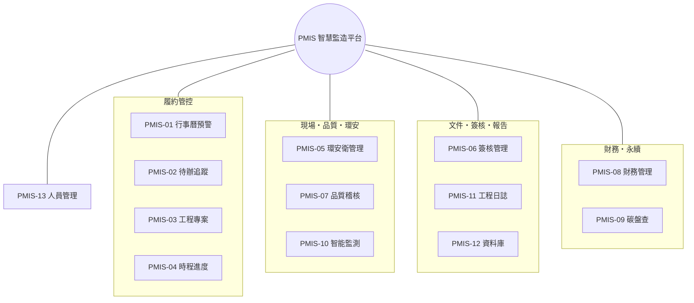
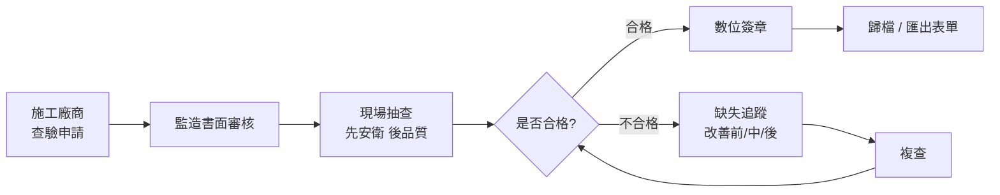

# PMIS 智慧監造管理系統 — 功能說明

協助**監造單位**於公共工程執行各階段的資訊化支援平台，整合施工各作業流程所需的功能模組，涵蓋公共工程全生命週期，並導入**費思 AI 助理**輔助文件判讀、憑證轉傳票、報告生成與工地影像分析，提升工程執行效率、履約管控力與管理透明度。目前系統共 **13 個功能模組**。

## 功能模組地圖

## 模組總覽

| 編號 | 功能 | 重點 | 專案切換 |
| --- | --- | --- | --- |
| PMIS-01 | 行事曆預警 | 履約期限、里程碑、送審、查核、改善期限之提醒與儀表板彙整 | — |
| PMIS-02 | 待辦追蹤 | 各單位待辦與改善辦理情形之紀錄、查詢、統計 | — |
| PMIS-03 | 工程專案 | 契約履約、里程碑、變更、文件、人力配置與專案總覽 | 專案內分頁 |
| PMIS-04 | 時程進度 | 工程進度、預定/實際、落後預警 | ✔ |
| PMIS-05 | 環安衛管理 | 環境、職安衛、交通維持稽核；AI 工地影像判讀 | ✔ |
| PMIS-06 | 簽核管理 | 送審文件、簽核流程設定與逐關簽核、送審清單 | ✔ |
| PMIS-07 | 品質稽核 | 施工查驗、材料抽驗、缺失改善追蹤 | ✔ |
| PMIS-08 | 財務管理 | 專案損益、收支、現金水位；憑證 AI 轉會計傳票 | ✔ |
| PMIS-09 | 碳盤查 | GHG Protocol/ISO 14064 溫室氣體盤查與跨專案彙總 | ✔ |
| PMIS-10 | 智能監測 | AIoT 感測與攝影機影像即時監測、事件標注、時間軸回溯 | ✔ |
| PMIS-11 | 工程日誌 | 費思依系統紀錄自動生成日/週/月/季/年報 | ✔ |
| PMIS-12 | 資料庫 | 工程監造紀錄、照片、影片、文件之集中查詢 | — |
| PMIS-13 | 人員管理 | 帳號、組織、職位與組織架構圖 | — |

## 共通功能

### 登入與權限
以帳號（Email）登入，登入後僅顯示個人被指派的專案內容。權限依角色分層：**系統管理員（ADMIN）與計畫主管（MANAGER）可檢視全部專案**；工程師、查驗員、唯讀等角色僅能檢視於「工程專案 → 人力配置」被指派的專案。各模組的統計與清單均依此範圍過濾。

### 費思 AI 助理
畫面右下角常駐的浮動助理「費思」，可即時問答監造相關問題，並支援**拖曳或上傳任意檔案**交由 AI 判讀。費思也在各模組提供專屬能力：財務憑證自動轉會計傳票（PMIS-08）、工程報告自動生成（PMIS-11）、工地影像安全與品質判讀（PMIS-05）。

### 專案切換
時程進度、環安衛、簽核管理、品質稽核、財務管理、碳盤查、智能監測、工程日誌等模組，均可於頁首以下拉切換「全部專案」或單一專案，聚焦檢視特定工程。

### 通知與行動裝置
系統操作以右下角對話氣泡通知即時回饋（含復原）。介面採響應式設計（RWD），手機以漢堡選單抽屜操作，表格可橫向捲動，支援行動裝置現場查詢。

## 各模組說明

### PMIS-01 行事曆預警
以行事曆與儀表板為核心，集中呈現具時效性的履約與監造事件並於期限前主動預警——含履約期限、工期里程碑、送審預定日、檢驗停留點、缺失改善期限、上級查核與會議等；儀表板彙整當日/當月應辦事項與整體健康度。

### PMIS-02 待辦追蹤
追蹤跨單位（監造、施工廠商、二級品管）之待辦與改善辦理情形；涵蓋缺失改善、送審退件修正、查驗待簽核等節點，可即時登錄、依單位/狀態/期限查詢與統計，逾期項目升級提醒。

### PMIS-03 工程專案（契約履約管理）
專案為系統核心。專案頁採分頁呈現，並以「總覽」為首頁彙整最關鍵資訊：
- **總覽**：進度落差、逾期未改善缺失、待查驗、剩餘工期等警示，進度環圈、契約與財務摘要、關鍵資料與近期動態。
- **基本資料**：名稱、地點（縣市可搜尋選單）、狀態、工期、工程摘要。
- **人力配置**：指派專案成員與其專案角色（專案經理／監造／查驗／成員），並決定成員可見的專案。
- **契約與文件、里程碑、變更紀錄、相關作業**（分項工程／查驗／缺失）。

### PMIS-04 時程進度
以預定/實際進度對比呈現各專案工項時程，落後即預警，並支援行動裝置隨時查詢分項工程進度、平均進度與里程碑達成度。可切換專案。

### PMIS-05 環安衛管理
記錄環境、職業安全衛生與交通維持之督導與稽核資料（日期、地點、抽查項目、缺失情形、改善期限與追蹤結果）。提供**費思 AI 工地影像判讀**：上傳工地照片自動辨識工安與品質疑慮並給改善建議。可切換專案。

### PMIS-06 簽核管理
管控設計、施工、材料設備與試驗報告之送審流程：簽核流程範本設定、逐關數位簽核、送審清單追蹤審查狀態與退件修正。可切換專案。

### PMIS-07 品質稽核
標準化施工查驗流程，管控施工品質抽查、材料設備抽驗與缺失改善成果，統計查驗合格率與未結案缺失。可切換專案。

### PMIS-08 財務管理
提供**專案損益、累計收支與現金水位**等即時財務資訊與支出分類。支援**上傳任意憑證（發票／收據／請款單），由費思自動轉換成會計傳票**並回填欄位，經確認後入帳；傳票具草稿→確認狀態流。可切換專案或檢視全部專案損益。

### PMIS-09 碳盤查
依 **GHG Protocol／ISO 14064-1** 進行溫室氣體盤查，涵蓋範疇一（直接排放）、範疇二（外購電力）、範疇三（上下游）。支援**多版本排放係數並存切換**（環境部係數管理表）、以係數快照確保可追溯、**排放強度基準可切換（預設契約金額）**、第三方查證狀態流與稽核軌跡。可於單一專案編輯活動數據（即時試算），或檢視跨專案彙總與排行。

### PMIS-10 智能監測
模擬串接 **AIoT 感測器與攝影機影像**，即時監看工地並由 AI **標注需要注意的事件**（未戴安全帽、進入吊掛區、動火、跌倒偵測、感測超標等），提供**事件時間軸回溯**，可凍結任一事件重現當時畫面與感測數值。可切換專案（工區）。

### PMIS-11 工程日誌
由**費思 AI 依系統紀錄自動生成**工程報告，支援**日報／週報／月報／季報／年報**切換；報告採含圖表（mermaid）的 Markdown 呈現，涵蓋進度、品質、送審、環安衛、碳排、里程碑與待改善事項，並附 AI 撰寫之摘要與建議。可切換專案。

### PMIS-12 資料庫
集中保存工程監造全程之數位紀錄，支援雲端查詢與持續更新：施工紀錄、取樣試驗、安衛環保、稽查紀錄、照片／影片／圖檔／掃描文件之上傳、預覽與歸檔。

### PMIS-13 人員管理
管理系統帳號、組織單位、職位與組織架構圖，並為工程專案人力配置提供人員來源。

## 施工查驗流程

> 進一步的 AI 流程優化，請見「AI 流程優化」分頁。
