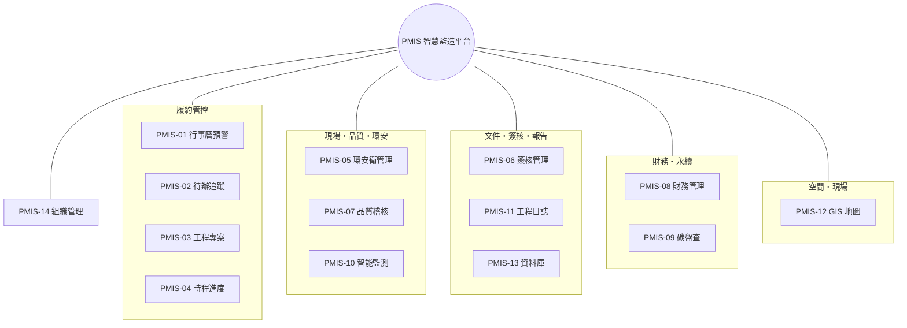
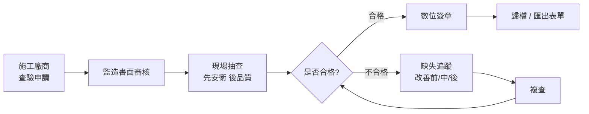

# PMIS 智慧監造管理系統 — 功能說明

協助**監造單位**於公共工程執行各階段的資訊化支援平台，整合施工各作業流程所需的功能模組，涵蓋公共工程全生命週期，並導入**費思 AI 助理**輔助文件判讀、憑證轉傳票、報告生成與工地影像分析，提升工程執行效率、履約管控力與管理透明度。目前系統共 **14 個功能模組**。

## 功能模組地圖

## 模組總覽

| 編號 | 功能 | 重點 | 專案切換 |
| --- | --- | --- | --- |
| PMIS-01 | 行事曆預警 | 履約期限、里程碑、送審、查核、改善期限之提醒與儀表板彙整 | — |
| PMIS-02 | 待辦追蹤 | 各單位待辦與改善辦理情形之紀錄、查詢、統計 | — |
| PMIS-03 | 工程專案 | 契約履約、里程碑、變更、文件、人力配置與專案總覽 | 專案內分頁 |
| PMIS-04 | 時程進度 | 工程進度、預定/實際、落後預警 | ✔ |
| PMIS-05 | 環安衛管理 | 環境、職安衛、交通維持稽核；AI 工地影像判讀 | ✔ |
| PMIS-06 | 簽核管理 | 送審文件、簽核流程設定與逐關簽核、送審清單 | ✔ |
| PMIS-07 | 品質稽核 | 施工查驗、材料抽驗、缺失改善追蹤 | ✔ |
| PMIS-08 | 財務管理 | 專案損益、收支、現金水位；憑證 AI 轉會計傳票 | ✔ |
| PMIS-09 | 碳盤查 | GHG Protocol/ISO 14064 溫室氣體盤查與跨專案彙總 | ✔ |
| PMIS-10 | 智能監測 | AIoT 感測與攝影機影像即時監測、事件標注、時間軸回溯 | ✔ |
| PMIS-11 | 工程日誌 | 費思依系統紀錄自動生成日/週/月/季/年報 | ✔ |
| PMIS-12 | GIS 地圖 | 政府圖資（TGOS／國土測繪／內政部統計）套疊 OSM 白底底圖，圖層開關、工地周邊風險判讀、專案自訂標記/路線/範圍 | ✔ |
| PMIS-13 | 資料庫 | 工程監造紀錄、照片、影片、文件之集中查詢 | — |
| PMIS-14 | 組織管理 | 帳號、組織、職位與組織架構圖 | — |

## 共通功能

### 登入與權限
以帳號（Email）登入。權限採**角色與職位分工、互不重疊**：

- **角色（AccountRole）** 只負責「系統身分與專案可視範圍」，精簡為三種：**系統管理員（ADMIN）** 不受限、可管理職位權限；**計畫主管（MANAGER）** 可檢視全部專案；**一般成員（MEMBER）** 僅檢視於「工程專案 → 人力配置」被指派的專案。
- **職位（Position）** 只負責「模組操作權限（無／檢視／可編輯）」，於組織管理（PMIS-14）設定，是能操作哪些模組、能否編輯的唯一來源。

**模組存取控制**：可操作的功能模組由使用者的**職位權限**（PMIS-14 職位管理設定）決定——
- 側欄僅顯示該職位有「檢視或可編輯」權限的模組；無權限的模組隱藏。
- 直接以網址進入無權限模組會自動導回儀表板。
- ADMIN 不受職位限制、一律可存取全部模組。

**檢視 vs 可編輯（已生效）**：權限層級的差異已全面落實，且採前後端雙重把關——
- **前端**：僅有「檢視」權限者，各模組頁面會隱藏所有「新建／編輯／刪除／狀態變更／簽核」等控制項，只保留唯讀顯示、檢視／下載、AI 判讀等不改資料的功能。
- **後端**：所有會寫入資料的 Server Action 都會先檢查該使用者對該模組是否有「可編輯」權限，否則直接略過不執行——即使繞過前端也無法改動資料，作為最後一道防線。
- ADMIN 於所有模組一律視為「可編輯」。

### 費思 AI 助理
畫面右下角常駐的浮動助理「費思」，可即時問答監造相關問題，並支援**拖曳或上傳任意檔案**交由 AI 判讀。費思也在各模組提供專屬能力：財務憑證自動轉會計傳票（PMIS-08）、工程報告自動生成（PMIS-11）、工地影像安全與品質判讀（PMIS-05）。

### 專案切換
時程進度、環安衛、簽核管理、品質稽核、財務管理、碳盤查、智能監測、工程日誌等模組，均可於頁首以下拉切換「全部專案」或單一專案，聚焦檢視特定工程。

### 通知與行動裝置
系統操作以右下角對話氣泡通知即時回饋（含復原）。介面採響應式設計（RWD），手機以漢堡選單抽屜操作，表格可橫向捲動，支援行動裝置現場查詢。

### 統一新建紀錄
全系統所有「建立新紀錄」皆採一致的操作邏輯與外觀：

- **橘色「新建」按鈕**（品牌主色）位於各模組頁面／區塊，點擊後於畫面中央彈出**表單對話框**。
- 表單支援**拖曳上傳檔案**（適用之模組，如文件上傳、送審參考文件、環安衛照片），可拖放或點擊選檔。
- 對話框下方固定「**取消 / 儲存**」；儲存中會禁用避免重複送出。
- **未儲存保護**：若已編輯而點取消、關閉或點遮罩，會跳出確認「放棄／繼續編輯」；整頁重新整理或關閉分頁亦會提示。
- 送出若有欄位驗證錯誤，訊息會顯示於對話框內且不關閉；成功則自動關閉並更新畫面。

已套用之建立流程涵蓋：工程專案、里程碑、分項工程、契約變更、契約文件、人力配置成員（PMIS-03/04）、查驗與缺失（PMIS-07）、環安衛稽核（PMIS-05，含費思 AI 照片判讀）、送審文件與簽核流程（PMIS-06）、工程日誌日報（PMIS-11，含帶入當日查驗/缺失）、資料庫文件上傳（PMIS-13）。各模組僅需提供欄位與儲存邏輯即獲得相同體驗（共用元件 `CreateRecordDialog`）。

## 各模組說明

### PMIS-01 行事曆預警
以行事曆與儀表板為核心，集中呈現具時效性的履約與監造事件並於期限前主動預警——含履約期限、工期里程碑、送審預定日、檢驗停留點、缺失改善期限、上級查核與會議等；儀表板彙整當日/當月應辦事項與整體健康度。

### PMIS-02 待辦追蹤
追蹤跨單位（監造、施工廠商、二級品管）之待辦與改善辦理情形；涵蓋缺失改善、送審退件修正、查驗待簽核等節點，可即時登錄、依單位/狀態/期限查詢與統計，逾期項目升級提醒。

### PMIS-03 工程專案（契約履約管理）
專案為系統核心。專案頁採分頁呈現，並以「總覽」為首頁彙整最關鍵資訊：
- **總覽**：進度落差、逾期未改善缺失、待查驗、剩餘工期等警示，進度環圈、**進度 S-Curve（預定／實際／預測，與里程碑資料連動）**、契約與財務摘要、關鍵資料、近期動態，以及**工地位置 GIS 小地圖**（PMIS-12）。
- **基本資料**：名稱、地點（縣市可搜尋選單）、狀態、工期、工程摘要。
- **人力配置**：指派專案成員與其專案角色（專案經理／監造／查驗／成員），並決定成員可見的專案。
- **契約與文件、里程碑、相關作業（分項工程／查驗／缺失）、變更紀錄**。

### PMIS-04 時程進度
以預定/實際進度對比呈現各專案工項時程，落後即預警，並支援行動裝置隨時查詢分項工程進度、平均進度與里程碑達成度。可切換專案。

#### 進度 S-Curve 與資料連動

專案總覽（PMIS-03）與儀表板皆以 **S-Curve** 呈現進度，逐月計算預定/實際/預測三條累計曲線。曲線完全由資料驅動，修改資料即時反映。

專案總覽的 S-Curve 卡提供**兩種計算基準**（右上角可切換）：

**基準一｜里程碑（Milestone，預設）** — 事件式，以里程碑**權重（weight）**累計。

| 曲線 | 來源欄位 | 資料如何影響 |
| --- | --- | --- |
| **預定累計 %**（藍虛線） | 里程碑「預定完成日 `plannedDate`」× 權重 | 調整預定日會左右移動曲線；提高某里程碑權重會加大其占比 |
| **實際累計 %**（綠實線） | 里程碑「實際完成日 `actualDate`」× 權重 | 填入/清除實際完成日即讓該期實際值上升/下降；僅計算到今日所在月 |
| **預測趨勢 %**（橘虛線） | 目前實際值 → 工期末月 | 自目前實際值線性外推至 100%，反映若維持現況的完工趨勢 |

換言之：**權重**決定每個里程碑對整體進度的貢獻比例；**預定完成日**塑形預定曲線；**實際完成日**塑形實際曲線。三者任一變動，S-Curve 與「落後/超前」判讀都會同步更新。

**基準二｜分項工程（WorkItem）** — 期間式，以工項**預定工期天數**為權重（工期越長貢獻越大）。

| 曲線 | 來源欄位 | 資料如何影響 |
| --- | --- | --- |
| **預定累計 %** | 工項預定起訖 `plannedStart`／`plannedEnd` | 各工項權重在其預定期間內**線性展開**；調整起訖日改變曲線斜率與時點 |
| **實際累計 %** | 工項 `progress`(%)、`actualStart`／`actualEnd` | 以目前進度為終值，自起始日線性分佈至今日；提高進度或提早起始即拉高曲線 |
| **預測趨勢 %** | 目前實際值 → 工期末月 | 同基準一 |

兩種基準各有適用：里程碑適合以**關鍵節點與權重**表達合約進度；分項工程適合以**實際工項進度**貼近現場施工狀況。可依管理需要於總覽切換比對。

**工項→里程碑 上捲（資料連動）**：分項工程可於「相關作業 → 分項工程」設定**歸屬里程碑**。里程碑基準的 S-Curve 會據此把工項進度**上捲**成里程碑達成度——原則為：里程碑若已手動填「實際完成日」則以其為準（合約認定優先），否則當其下工項加權進度達 100% 時，以工項最後實際完工日視為達成。里程碑分頁會顯示各里程碑的「工項推算 X%（n 項）」。沒有歸屬任何工項的里程碑，維持以手動實際完成日判定。如此工項→里程碑→專案形成單向上捲，兩種基準得以對帳。

此「上捲進度」為**全系統單一定義**：專案列表、專案總覽（進度環圈與落差警示）、里程碑分頁、費思畫面摘要、工程日誌報表與儀表板 S-Curve，皆採同一計算，數字一致。

操作要點：
- 於「里程碑」分頁設定合理**權重**與**實際完成日**（基準一）；於「相關作業 → 分項工程」維護工項**預定/實際起訖日與進度 %**（基準二）。
- 總覽卡上的「落後預定 X%／準時超前 X%」= 目前實際累計 − 目前預定累計，可作為即時預警（依所選基準計算）。
- 里程碑（`MILESTONE`）用於進度計算，展延（`EXTENSION`）不納入；分項工程需具備預定起訖日才會納入曲線。

### PMIS-05 環安衛管理
記錄環境、職業安全衛生與交通維持之督導與稽核資料（日期、地點、抽查項目、缺失情形、改善期限與追蹤結果）。提供**費思 AI 工地影像判讀**：上傳工地照片自動辨識工安與品質疑慮並給改善建議。可切換專案。

### PMIS-06 簽核管理
管控設計、施工、材料設備與試驗報告之送審流程：簽核流程範本設定、逐關數位簽核、送審清單追蹤審查狀態與退件修正。可切換專案。

### PMIS-07 品質稽核
標準化施工查驗流程，管控施工品質抽查、材料設備抽驗與缺失改善成果，統計查驗合格率與未結案缺失。可切換專案。選定單一專案後可**新增查驗與缺失**，並指定其**所屬工項（連結 PMIS-04 分項工程）**，缺失清單會顯示對應工項，打通「工項—查驗—缺失」的追溯關聯。

### PMIS-08 財務管理
提供**專案損益、累計收支與現金水位**等即時財務資訊與支出分類。支援**上傳任意憑證（發票／收據／請款單），由費思自動轉換成會計傳票**並回填欄位，經確認後入帳；傳票具草稿→確認狀態流。可切換專案或檢視全部專案損益。

### PMIS-09 碳盤查
依 **GHG Protocol／ISO 14064-1** 進行溫室氣體盤查，涵蓋範疇一（直接排放）、範疇二（外購電力）、範疇三（上下游）。支援**多版本排放係數並存切換**（環境部係數管理表）、以係數快照確保可追溯、**排放強度基準可切換（預設契約金額）**、第三方查證狀態流與稽核軌跡。可於單一專案編輯活動數據（即時試算），或檢視跨專案彙總與排行。

### PMIS-10 智能監測
模擬串接 **AIoT 感測器與攝影機影像**，即時監看工地並由 AI **標注需要注意的事件**（未戴安全帽、進入吊掛區、動火、跌倒偵測、感測超標等），提供**事件時間軸回溯**，可凍結任一事件重現當時畫面與感測數值。可切換專案（工區）。

### PMIS-11 工程日誌
分為兩部分：
- **日報（監造報表）**：由**監造人員人工填報**（天氣、按圖施工概況、工地人員及機具、重要事項，狀態流 草稿→已提送→已核備；同一專案同日再次送出即更新）。填報時可**一鍵帶入當日查驗／缺失**（串接 PMIS-07）至施工概況與重要事項。**日報不再由 AI 直接生成。**
- **週／月／季／年報**：由**費思 AI 依系統紀錄自動彙整**，並**納入當期人工填報之監造日報內容**（日報摘要另列於報告「監造日報彙整」段）。採含圖表（mermaid）的 Markdown 呈現，涵蓋進度、品質、送審、環安衛、碳排、里程碑與待改善事項，並附 AI 撰寫之摘要與建議。

日報填報結果同步彙整至資料庫（PMIS-13）供查詢歸檔。可切換專案。

### PMIS-12 GIS 地圖
以 **OpenStreetMap 白底底圖**為基礎，套疊臺灣政府開放圖資，讓監造與工程人員快速掌握工地周邊環境與施工風險。

- **政府圖資整合**：串接**臺灣政府 TGOS MAP API**（地址定位、通用電子地圖）、**國土測繪圖資服務雲 API**（土壤液化潛勢、地質敏感區/山崩地滑、活動斷層、各級學校範圍、避難收容所、消防栓、正射影像、地籍/段籍、國土利用現況等 WMTS 圖層）、**內政部統計地圖 API**（村里社會經濟統計）。圖資依**年份、類別**下載為 **data seed 檔案**離線快取，降低對外部服務的即時依賴。
- **圖層開關**：左側圖層面板可逐項切換各主題圖層顯示與否（災害潛勢、鄰近敏感設施、地籍、影像等），並可調整透明度與堆疊順序。
- **工地風險判讀**：以專案工地座標為中心，自動標示是否位於**土壤液化/地質敏感/斷層帶**、是否**鄰近學校、醫院、避難所**等施工需注意事項，並列出周邊敏感點清單與距離。
- **專案切換與自訂圖徵**：可切換專案聚焦其工區，並針對專案新增**自訂地標（點）、路線圖（線，如便道/管線）、圈定範圍（面，如施工圍籬/警戒區）**，供現場交底與交通維持規劃使用。

### PMIS-13 資料庫
集中保存工程監造全程之數位紀錄，支援雲端查詢與持續更新：施工紀錄、取樣試驗、安衛環保、稽查紀錄、照片／影片／圖檔／掃描文件之上傳、預覽與歸檔。可**直接在資料庫上傳文件**（選擇專案、分類、標題，支援 PDF／PNG／JPG），並對文件進行**閱覽（線上檢視／下載）與管理（刪除）**。此外，**系統各環節上傳的檔案（環安衛稽核附件、簽核文件附件等）會自動彙整於「各模組上傳檔案」清單**，資料庫因此是所有上傳檔案的單一入口，可追溯來源與關聯。監造報表（日報）於**工程日誌（PMIS-11）**填報，於此集中歸檔查詢。

### PMIS-14 組織管理
管理系統帳號、組織單位、職位與組織架構圖，並為工程專案人力配置提供人員來源。

**職位模組權限**：於「職位」分頁提供一張「職位 × 模組」權限矩陣，可為每個職位逐一設定各功能模組的操作權限——**無**（不可進入）、**檢視**（唯讀）、**可編輯**（可新增/修改）。每列提供快速鍵一次套用整列（全設無/檢視/可編輯），修改後按「儲存權限」一次保存；欄位以顏色標示（檢視藍、可編輯綠）方便快速掌握。此設定作為模組存取控制的依據。

## 施工查驗流程

> 進一步的 AI 流程優化，請見「AI 流程優化」分頁。
