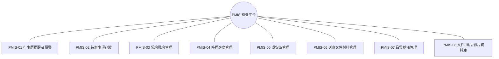
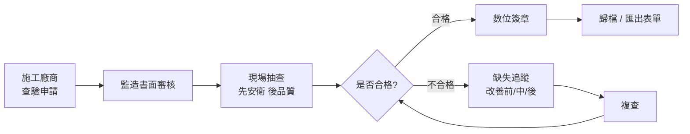

# PMIS 智慧監造管理系統 — 功能說明

協助**監造單位**於公共工程執行各階段的資訊化支援平台，整合施工各作業流程所需的功能模組，涵蓋公共工程全生命週期，提升工程執行效率、履約管控力與管理透明度。功能設計參考**行政院公共工程委員會 PMIS 推廣版**操作規範，以「PM 管控」視角歸納為 8 大功能模組。

## 功能模組地圖

## 模組總覽

| 編號 | 功能 | 契約要求整理 | PM 管控提醒 |
| --- | --- | --- | --- |
| PMIS-01 | 行事曆提醒及預警 | 提醒履約期限、會議、送審、查核、改善期限 | Dashboard 與通知機制 |
| PMIS-02 | 待辦事項追蹤 | 追蹤各單位待辦事項與改善辦理情形 | 需可即時紀錄、查詢、統計 |
| PMIS-03 | 契約履約管理 | 契約文件、履約事項、變更、罰則與付款節點 | 需與履約期限連動 |
| PMIS-04 | 時程進度管理 | 工程進度、預定/實際、落後預警 | 需可供行動裝置查詢進度 |
| PMIS-05 | 環安衛管理 | 環境、職安衛、交通維持督導與稽核資料 | 需建置稽核紀錄 |
| PMIS-06 | 送審文件材料管理 | 設計、施工、材料設備、試驗報告送審資料 | 需可追蹤審查狀態與退件修正 |
| PMIS-07 | 品質稽核管理 | 施工品質抽查、材料設備抽驗、缺失改善 | 需可統計與追蹤改善成果 |
| PMIS-08 | 文件/照片/影片資料庫 | 工程監造紀錄、工程照片、影片、文件 | 需雲端查詢及持續更新 |

## 各模組說明

### PMIS-01 行事曆提醒及預警
以行事曆與儀表板為核心，集中呈現具時效性的履約與監造事件，並於期限前主動預警——含履約期限、工期里程碑、送審預定日、檢驗停留點、缺失改善期限、上級查核與會議等，儀表板彙整當日/當月應辦事項。

### PMIS-02 待辦事項追蹤
追蹤跨單位（監造、施工廠商、二級品管）之待辦與改善辦理情形；涵蓋缺失改善、送審退件修正、查驗待簽核等節點，可即時登錄、依單位/狀態/期限查詢與統計，逾期項目可升級提醒。

### PMIS-03 契約履約管理
建立標案全生命週期的履約起始資料，作為後續作業的基礎：標案基本資料、**契約變更**（次數、內容、變更後金額、變更天數）、**工期里程碑**與**工期展延**、**罰則與付款節點**，並與履約期限連動。

### PMIS-04 時程進度管理
以預定/實際進度對比呈現工程時程，落後即預警，並支援行動裝置隨時查詢——分項工程進度百分比、S 曲線、里程碑達成度與關鍵路徑影響追蹤。

### PMIS-05 環安衛管理
記錄環境、職業安全衛生與交通維持之督導與稽核資料。定期與不定期巡檢涵蓋高風險作業防護、機具設備安全、防墜與臨邊防護、作業環境衛生、廢棄物與污水、粉塵與噪音等；稽核紀錄含日期、地點、抽查項目、缺失情形、改善期限與追蹤結果，並可附現場照片與 GPS 座標。

### PMIS-06 送審文件材料管理
管控設計、施工、材料設備與試驗報告之送審流程，嚴格追蹤送審狀態與退件修正：抽驗管理標準、送審管制總表、檢(試)驗管制總表；支援批次匯入建置材料資料庫，記錄預定/實際送審日期、審查結果與歸檔編號；不合格自動列管於不合格追蹤管制表。

### PMIS-07 品質稽核管理
標準化施工查驗流程，管控施工品質抽查、材料設備抽驗與缺失改善成果。查驗申請 → 現場填報（先安衛、後品質，含 GPS 定位）→ 不合格追蹤（改善前/中/後照片）→ 監造工程師與主管數位簽章 → 歸檔與表單匯出；並依年月統計查驗與缺失數量。

### PMIS-08 文件/照片/影片資料庫
集中保存工程監造全程之數位紀錄，支援雲端查詢與持續更新，落實無紙化與資料治理：施工紀錄、取樣試驗、安衛環保、業主指示、稽查紀錄；照片/影片/圖檔/掃描文件之上傳、預覽與歸檔；**監造報表**每日填報並可由查驗紀錄自動匯入。

## 施工查驗流程

> 進一步的 AI 流程優化，請見「AI 流程優化」分頁。
