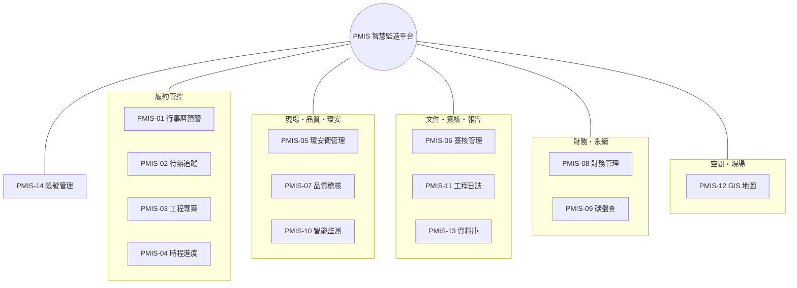

# PMIS 智慧監造管理系統 — 系統總覽

協助**監造單位**於公共工程執行各階段的資訊化支援平台，整合施工各作業流程所需的功能模組，涵蓋公共工程全生命週期，並導入**費思 AI 助理**輔助文件判讀、憑證轉傳票、報告生成與工地影像分析，提升工程執行效率、履約管控力與管理透明度。目前系統共 **14 個功能模組**。

> 想了解共通操作（登入權限、統一新建、專案切換等）請見「共通功能」分頁；各模組細節請見「模組詳解」分頁。

## 功能模組地圖

## 模組總覽

| 編號 | 功能 | 重點 | 專案切換 |
| --- | --- | --- | --- |
| PMIS-01 | 行事曆預警 | 履約期限、里程碑、送審、查核、改善期限之提醒與儀表板彙整 | — |
| PMIS-02 | 待辦追蹤 | 各單位待辦與改善辦理情形之紀錄、查詢、統計 | — |
| PMIS-03 | 工程專案 | 契約履約、里程碑、變更、文件、人力配置與專案總覽 | 專案內分頁 |
| PMIS-04 | 時程進度 | 工程進度、預定/實際、落後預警 | ✔ |
| PMIS-05 | 環安衛管理 | 環境、職安衛、交通維持稽核；AI 工地影像判讀 | ✔ |
| PMIS-06 | 簽核管理 | 送審文件、簽核流程設定與逐關簽核、送審清單 | ✔ |
| PMIS-07 | 品質稽核 | 施工查驗、材料抽驗、缺失改善追蹤 | ✔ |
| PMIS-08 | 財務管理 | 專案損益、收支、現金水位；憑證 AI 轉會計傳票 | ✔ |
| PMIS-09 | 碳盤查 | GHG Protocol/ISO 14064 溫室氣體盤查與跨專案彙總 | ✔ |
| PMIS-10 | 智能監測 | AIoT 感測與攝影機影像即時監測、事件標注、時間軸回溯 | ✔ |
| PMIS-11 | 工程日誌 | 監造日報人工填報；費思依系統紀錄自動生成週/月/季/年報 | ✔ |
| PMIS-12 | GIS 地圖 | 政府圖資（TGOS／國土測繪／內政部統計）套疊 OSM 白底底圖，圖層開關、工地周邊風險判讀、專案自訂標記/路線/範圍 | ✔ |
| PMIS-13 | 資料庫 | 工程監造紀錄、照片、影片、文件之集中查詢與上傳管理 | — |
| PMIS-14 | 帳號管理 | 帳號、組織、職位（模組權限）與組織架構圖 | — |
